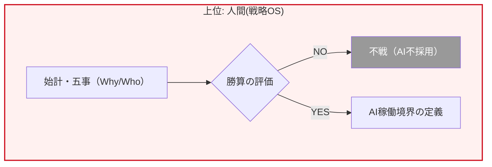
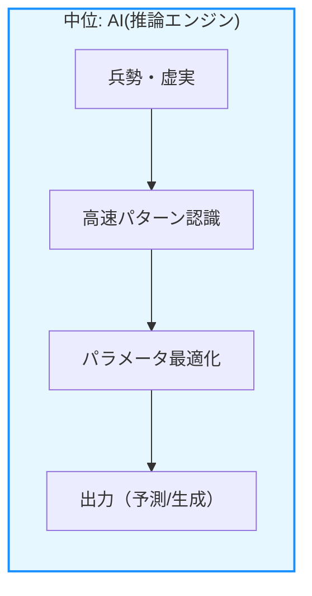
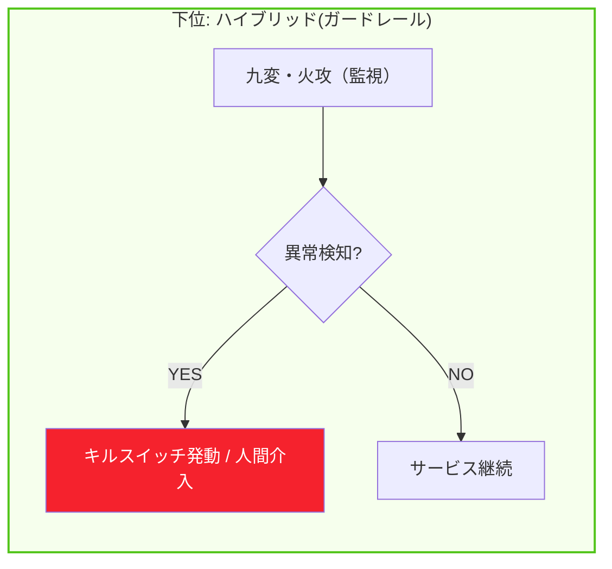

020-040.孫子&AI を統合した「1枚の統合フレーム」
# 結論

孫子の兵法を 「上位OS（意思決定の統治）」 と捉え、AIをその境界内で稼働する 「推論エンジン（実行の最適化）」 と定義する。この役割分担を明確化し、「人間が戦略の枠組みを、AIが計算の実行を」 担う構造を敷くことは、AI活用の不確実性を制御し、持続可能な成果を出すための極めて有力なアプローチとなります。

# 孫子×AI 統合フレーム（三層構造）

### 1. 上位レイヤー：人間による「判断設計・統治」

* **担当：** 人間（経営層・アーキテクト）
* **機能：** 目的（Why）の定義、責任（Who）の所在、勝算（When/Where）の評価。
* **孫子の対応：** **始計・五事・謀攻**
* **設計思想：** AIに「何を考えさせるか」の枠組みを決定し、勝機がない場合には「AIを使わない」という不戦の決断を下す。

### 2. 中位レイヤー：AIによる「推論・最適化」

* **担当：** AI（アルゴリズム・モデル）
* **機能：** 高速なパターン認識、将来予測、条件内でのパラメータ最適化。
* **孫子の対応：** **兵勢・虚実・軍争**
* **設計思想：** 人間が定義した「土俵（境界条件）」の中で、リソース（計算資源）の勢いを最大化し、効率的に成果を出す。

### 3. 下位レイヤー：ハイブリッドによる「安全・例外制御」

* **担当：** 人間 ＋ 監視システム
* **機能：** 異常検知、強制停止、判断プロセスのログ保存。
* **孫子の対応：** **九変・行軍・火攻**
* **設計思想：** 状況が変化した際に「立ち止まる」仕組み。AIの暴走（火）を検知し、人間が即座に介入（HITL）して被害を最小化する。

# 統合フレーム：運用マトリクス

| 階層     | 主な問い        | 孫子のエッセンス        | システム要件への翻訳        |
| ------ | ----------- | --------------- | ----------------- |
| **上位** | **やるべきか？**  | 「計（計算）」と「道（目的）」 | ROI評価・倫理憲章・責任者任命  |
| **中位** | **どう解くか？**  | 「奇正（変化）」と「虚実」   | RAG・モデル選定・プロンプト設計 |
| **下位** | **止められるか？** | 「九変（適応）」と「火攻」   | ガードレール・ログ・キルスイッチ  |

# 一文まとめ

> **孫子の兵法は、AIに「何を考えさせるか」の境界線を引くための「知性」であり、**
> **AIは、その境界線の中で「どう実行するか」を計算するための「機能」である。**

この1枚のフレームワークが共有されている組織では、AIの導入が「博打（運任せ）」から「戦略（計算された勝利）」へと変わります。AIが賢くなることを待つのではなく、人間が「賢い使い方（不敗の形）」を先に設計することが、AI時代を勝ち抜くための極めて有力なアプローチとなります。