# 意思決定モデル

```mermaid
flowchart TB
    A[孫子の兵法<br/>＝AI意思決定の上位思想]

    A --> B[判断設計層（人）<br/>■ 目的を決める<br/>■ 使うか/使わないか決める<br/>■ 失敗条件を定義]
    A --> C[最適化層（AI）<br/>■ 推論・予測<br/>■ パターン認識<br/>■ 条件内最適化]
    A --> D[制御・安全層（人＋AI）<br/>■ 人の介入<br/>■ ログ・再現性<br/>■ 停止・撤退]

    B --> B1[五事：道・将・天・地・法]
    D --> D1[倫理原則：<br/>公益性・説明責任・公平性・透明性]

    B1 --> C
    C --> D

    D --> E[社会に出してよいAI]
```

# 【経営向け】意思決定スライド

### スライド1行キャプション

> **孫子は「AIに何をさせないか」を決める思想、  
> AIはその枠内で最適化する道具**

### 経営向け読み替え

- **論点は3つだけ**
    
    1. 目的は正しいか
        
    2. 責任は引き受けられるか
        
    3. 事故っても耐えられるか
        

> 💡 _精度・技術詳細は見ない。  
> 判断と責任だけを見る。_

# 【現場向け】設計・運用スライド

**現場向け読み替え**
作る前に止める判断ができるか

**運用できないAIは完成ではない**

💡 「作れるか」ではなく
「事故らずに運用できるか」