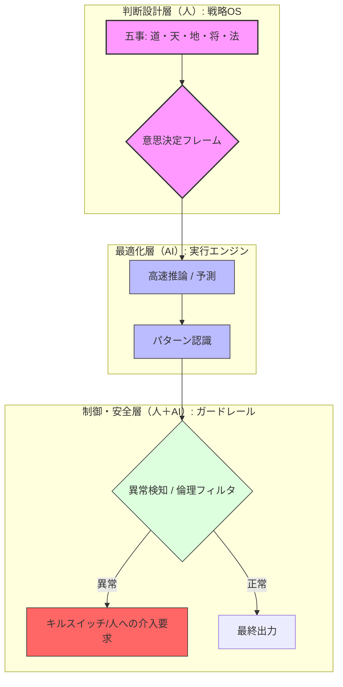
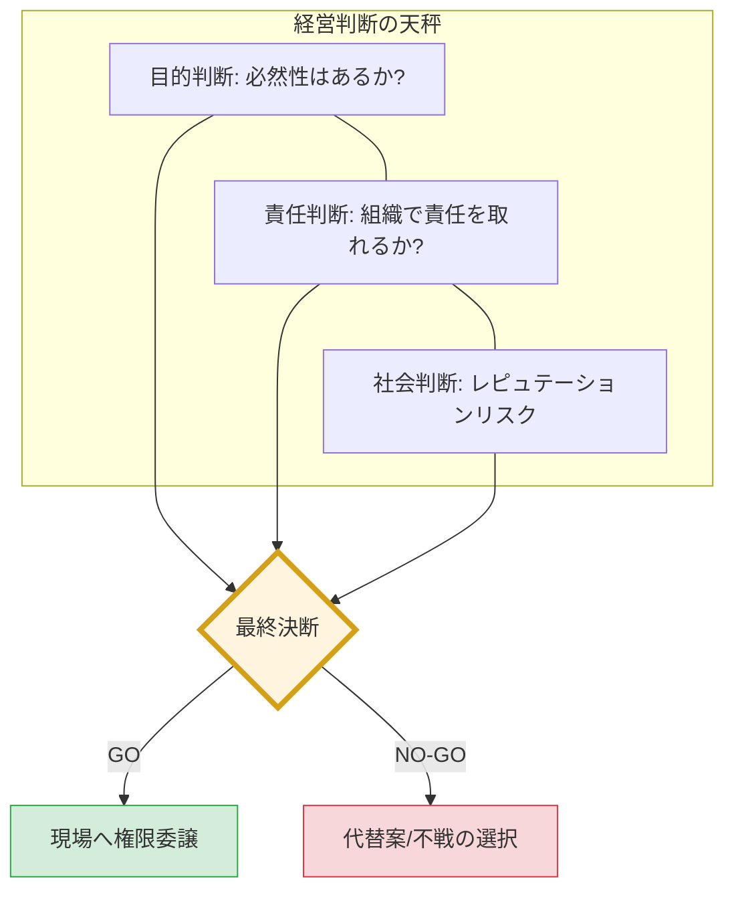
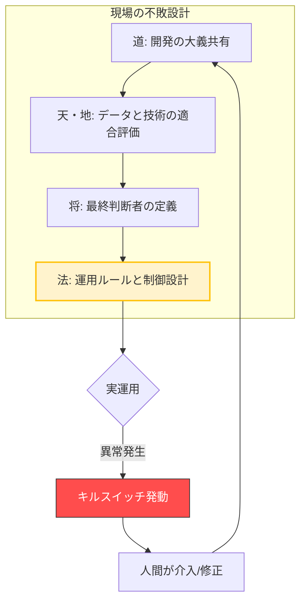

# 概要

AI導入の意思決定において、人間が解くべきは「戦略」であり、AIが解くべきは「最適化」です。本項では、孫子の思想を「判断・実行・制御」の3層に分離した意思決定モデルを提示します。

# 1. 総合意思決定アーキテクチャ

孫子の兵法を上位OSとし、人間が「土俵（フレーム）」を、AIが「推論」を担当する構造です。

* **判断設計層（人）：** 「五事」に基づき、目的の正当性、リソースの妥当性、撤退基準を定義します。
* **最適化層（AI）：** 人間が定義した境界条件の中で、高速にパターン認識と予測を行います。
* **制御・安全層（人＋AI）：** 現代の「倫理原則」をパッチとして当て、異常検知時の停止や介入を司ります。

# 2. 【経営層向け】導入判断モデル

経営層が向き合うべきは、アルゴリズムの優劣ではなく **「リスクと責任のバランス」** です。

* **目的判断：** なぜAIなのか？ 代替手段（人や既存システム）で「戦わずして勝つ」道はないか。
* **責任判断：** AIが誤った際、その社会的・経済的責任を組織として引き受けられるか。
* **社会判断：** 公益性はあるか。事故が起きた際のレピュテーションリスクに耐えられるか。

> **経営判断の鉄則：**
> **技術の詳細は見ない。「目的の正しさ」と「責任の所在」の2点のみでGO/NO-GOを決する。**

# 3. 【現場向け】設計・運用モデル

現場のエンジニアやSAが死守すべきは、**「不敗の形（堅牢な運用）」**です。

* **道：** なぜこのAIを実装するのか、開発チーム内で「大義」を共有できているか。
* **天・地：** 今のデータセット（地）と、モデルの進化速度（天）は実運用に耐えうるか。
* **将：** 判断に迷った際、最終的に誰が「白黒」をつけるのか。
* **法：** **「止められるか？」** 異常時に人間が即座に介入できる「キルスイッチ」があるか。

> **現場設計の鉄則：**
> **「作れるか？」よりも「事故らずに運用できるか？」を優先する。運用設計が未完成のAIは、技術的に動いても「未完成」とみなす。**

# 一文まとめ

> **孫子は「AIに何をさせないか」の境界線を引く思想であり、**
> **AIはその安全な境界内で、能力を最大化する道具である。**

この役割分担を明確にすることで、経営層は「安心」して投資でき、現場は「確信」を持って開発に取り組むことが可能になります。
