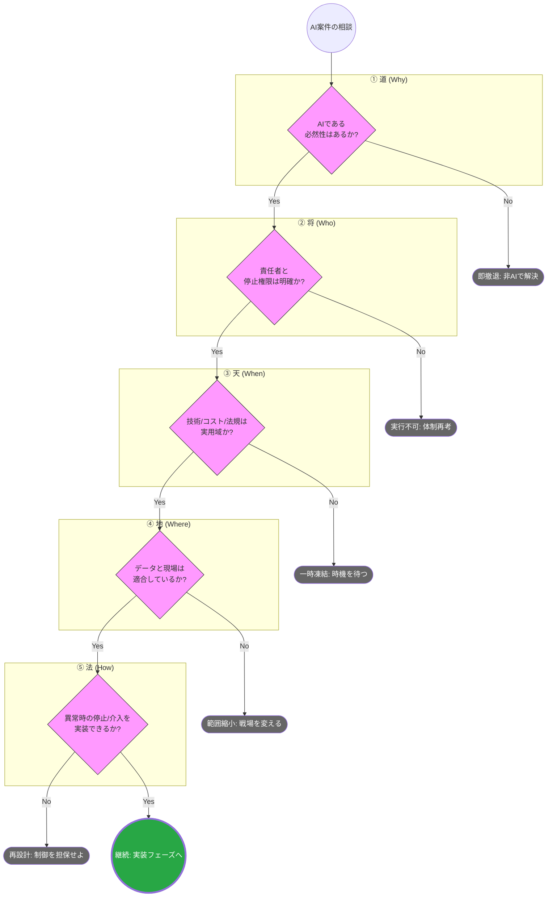

# 概要

AI導入の失敗の多くは、技術的な実装フェーズではなく、その手前の「判断」のミスに起因します。このフロー図は、孫子の五事（道・将・天・地・法）をフィルタとして使い、**「勝算のない、あるいは制御不能なAI案件」を早期にデバッグ（排除）する**ためのものです。

# AI導入可否判定フロー：五事のフィルター

### 1. **【道：Why】目的の必然性**
* **問い：** なぜAIなのか？ 既存のロジックや人力、プロセス改善では目的を達成できないのか？
* **撤退判断：** AIである必然性が乏しい場合、**「即撤退（非AI化）」**。技術の流行に予算を投じるのは下策です。

### 2. **【将：Who】責任の所在**
* **問い：** AIが誤った判断をした際、その結果を引き受け、システムを停止させる権限を持つ「人間」が誰か決まっているか？
* **撤退判断：** 責任者が曖昧、あるいは現場に責任を押し付ける構造なら **「実行不可」**。

### 3. **【天：When】時機の成熟度**
* **問い：** 現在のAIの精度、推論コスト、および関連する法規制は、ビジネスとして実用域にあるか？
* **凍結判断：** 理想に対して技術が未熟、あるいは規制リスクが予見される場合は **「一時凍結」**。

### 4. **【地：Where】環境の適合性**
* **問い：** 自社のデータ品質、現場のITリテラシー、既存の業務フローとAIは無理なく噛み合うか？
* **変更判断：** 現場の抵抗が強い、あるいはデータが不毛な場合は **「戦場変更（範囲縮小）」**。

### 5. **【法：How】制御の実現性**
* **問い：** 人間の介在（HITL）、異常時の停止機構、原因究明のためのログ運用を実装・維持できるか？
* **改善判断：** 「止められない」リスクが残る場合は、**「再設計」** を強制し、クリアするまで本番投入を認めません。

# 実務での活用アドバイス

このフローは、**「左から右へ流すチェックリスト」ではなく、「一つでもNoがあれば次に進ませないゲート」** として運用してください。

> **SAの金言：**
> 孫子における「計（計算）」とは、ポジティブな要素を数えることではなく、**「懸念点がゼロになるまで疑い抜くこと」** にあります。このフローで「継続」に至った案件こそが、真に投資価値のあるAIプロジェクトです。

>「SAとは、システムアナリスト（Systems Analyst）またはシステムアーキテクト（System Architect）。
