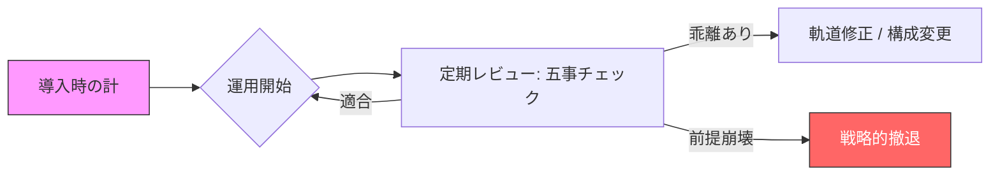

# 概要

AIプロジェクトの成否を「導入時の瞬間最大風速（点）」だけで判断してはいけません。技術の進化（天）や現場の状況（地）は常に変化します。本項では、五事のフレームワークを使い、プロジェクトの健康状態を **「継続的な時系列（線）」** で監視し、適宜軌道修正を行うガバナンス体制を提案します。

### 1. 「五事」の定点観測（ヘルスチェック）

導入時に満たしていた「五事」の条件が、時間の経過とともに崩れていないかを定期的に確認します。

* **道（Why）の再確認：** 運用が続くうちに「AIを使うこと」が目的化し、当初の課題解決からズレていないか？
* **将（Who）の引継ぎ：** 異動や体制変更により、異常時に責任を持って「止める」判断ができる人間が不在になっていないか？
* **天（When）の監視：** より安価で高精度な新モデルが登場し、現在の構成が「高コストで非効率」な負債になっていないか？

### 2. 「不敗」を維持するためのモニタリング・ループ

ガバナンスを「監査」ではなく、次の勝利のための「ナビゲーション」として機能させます。

### 3. 評価指標のシフト：精度から「統治コスト」へ

AIの「精度」だけに目を向けると、現場の疲弊（地）や運用の綻び（法）を見逃します。

* **点での評価：** 「回答の正解率は何%か？」
* **線での評価：** 「人間が介在（修正・監視）するコストは下がっているか？ 制御不能な例外は増えていないか？」

> **SAの視点：**
> 継続的なガバナンスとは、**「不敗の形を維持し続けるための定期メンテナンス」**です。これを仕組み化することで、現場は「一度決めたら後戻りできない」という恐怖から解放され、より柔軟で大胆なAI活用が可能になります。

>「SAとは、システムアナリスト（Systems Analyst）またはシステムアーキテクト（System Architect）。
