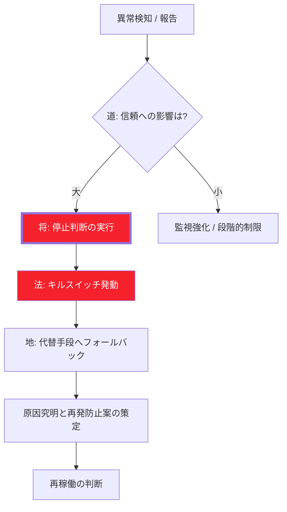

# 結論

AIの事故対応において、最大の敵は「モデルの修正方法を考えること」です。孫子の兵法では、危うきを察すれば即座に陣を引くことが不敗の条件です。**「まず止める、原因はその後」**。この徹底した撤退の規律が、組織を致命傷から救います。

# AI緊急停止プロトコル（実戦版）

### STEP 1：即時停止（30秒）｜疑わしきは断つ

* **判断：** 現場の利用者、または監視システムが「異常（誤答、暴言、法的リスク等）」を検知。
* **行動：** **「停止ボタン」を迷わず押す。** AIの出力を即座に無効化し、旧来の「人間による手動運用」に強制的に切り替えます。
* **規律：** 確信が持てなくても「違和感」があれば止める。様子見は敗北への道です。

### STEP 2：責任者判断（5分）｜「将」の決断

* **確認：** 事前に指定された「AI責任者（将）」が、状況を3点のみで評価します。
1. **被害：** 顧客や社会に対し、実害が発生しているか？
2. **再発：** 放置すれば、同様の誤出力が続く構造か？
3. **代替：** 人手による運用で、最低限の業務が回るか？

* **決断：** 「全面停止」か「機能を絞った限定再開」かを即断します。

### STEP 3：被害の封じ込め（10分）｜延焼を食い止める

* **行動：** 該当するユーザーや機能のアクセス制限を行い、問題となった出力の**ログ（証拠）を保全**します。
* **対外対応：** 必要な場合は、法務・広報と連携し、影響範囲への周知を開始します。
* **規律：** バグ修正を始めてはいけません。まずは「被害の境界線」を引くことに全力を注ぎます。

### STEP 4：原因の切り分け（後続）｜情報の精査

* **分析：** データ（地）の問題か、プロンプトやロジック（法）の不備か、チェック体制（将）の隙か。
* **規律：** 原因が特定され、対策が講じられるまで、AIを戦場（本番環境）に戻してはなりません。

### STEP 5：再開判断（別日）｜段階的な帰還

* **条件：** 再発防止策の明文化、および人間による「チェックポイント（検閲）」の強化。
* **行動：** いきなり100%戻すのではなく、特定のユーザーや限定的な用途から**「段階的」に再開**します。

# 組織として死守すべき「不敗の3条件」

1. **停止ボタンの場所：** エンジニアでなくても、管理画面からワンクリックでAIをオフにできるか。（技術）
2. **止める権限者：** 現場の判断を経営が尊重し、「止めてくれてありがとう」と言える体制か。（人）
3. **止めてOKな文化：** AIを止めることを「失敗」ではなく「適切なリスク管理」と称賛できるか。（組織）

# 一文まとめ

> **「止めてから考える」はプロの判断であり、**
> **「様子を見る」は事故を拡大させる素人の怠慢である。**
