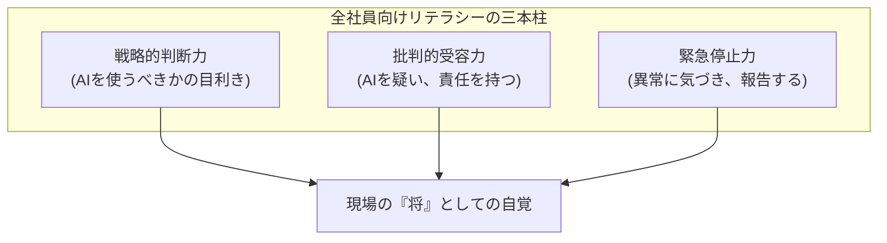

# 概要

AIリテラシー研修のゴールは、Pythonが書けるようになることではありません。**「AIという強力な力を、いつ、どこで、どう使うべきか（あるいは止めるべきか）」を、孫子の五事という共通言語で判断できる文化**を根付かせることです。

# 1. 【道（Why）：目的】「何でもAI」という信仰からの脱却

* **教育の核心：** AIは魔法の杖ではなく、リスクを伴う「ツール」であることを教えます。
* **ワークショップ：** 「この業務にAIを使う必然性は本当にあるか？」を問い直し、非AI手段（既存ルールの徹底など）の方が「勝算」が高いケースを議論します。

# 2. 【将（Who）：責任】「AIが言ったから」を禁句にする

* **教育の核心：** 最終的な判断の責任は、常に「その画面の前にいる人間」にあることを徹底します。
* **行動指針：** AIの出力をそのままコピペ・実行することを「将としての職務放棄」と定義し、批判的思考（クリティカル・シンキング）を持ってAIと対峙する姿勢を養います。

# 3. 【地（Where）：環境】データの「毒」を見抜く目を養う

* **教育の核心：** AIが参照しているデータ（地形）が、偏っていたり古かったりする場合の危険性を教えます。
* **実務演習：** 自社のデータセットに含まれるバイアスや不備を特定し、「この地（データ）で戦えば、AIは誤った答えを出す」と予見できる能力を磨きます。

# 4. 全社員向け「五事判定」トレーニング（簡易版）

社員が新しいAIツールを使い始める際に、セルフチェックさせるための3つの問いです。

| 観点                   | セルフチェック項目                           | 孫子のエッセンス         |
| -------------------- | ----------------------------------- | ---------------- |
| **道(Why)×将(Who)**    | この出力でトラブルが起きた時、**自分が責任を持って説明できるか？** | **道（大義）と将（責任）**  |
| **天(When)×地(Where)** | このデータは最新か？ **今の状況（現場）に適しているか？**     | **天（時機）と地（環境）**  |
| **法(How)**           | おかしいと感じた時、**すぐにプロセスを止める手順を知っているか？** | **法（規律・キルスイッチ）** |

# 5. アーキテクト（SA）から人事・教育担当への助言

AI教育を「技術の習得」だけに絞ると、現場は「技術に使われる側」になってしまいます。

* **共通言語を作る：** 「あのプロジェクト、五事(Five Factors)のうち『地(Where)』が怪しいよね」といった会話が社員間で交わされるようになれば、組織の防衛力は飛躍的に高まります。
* **失敗を共有する「法」：** AIを止めた判断、AIのハルシネーションを見抜いた事例を「ファインプレー」として表彰する文化を作ってください。

>**「100人のエンジニアを育てるより、10,000人の『五事を知る賢明な判断者（一般社員）』を育てるほうが、組織ははるかに不敗に近づく。」**

