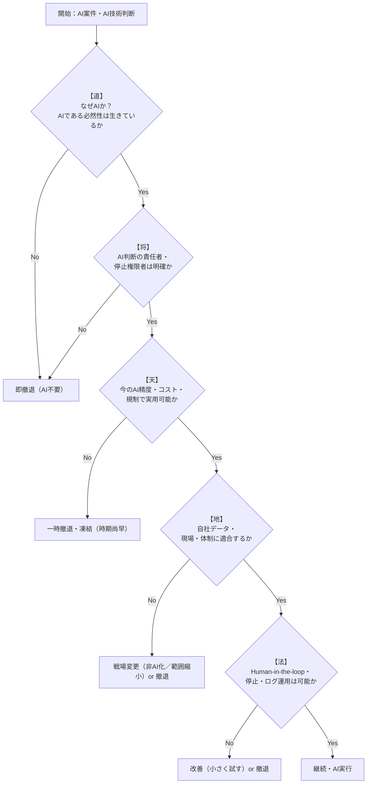

五事の1枚フロー図

```mermaid
flowchart TD
    A[開始：AI案件・AI技術判断] --> B{【道】<br/>なぜAIか？<br/>AIである必然性は生きているか}
    B -- No --> X[即撤退（AI不要）]
    B -- Yes --> C{【将】<br/>AI判断の責任者・<br/>停止権限者は明確か}

    C -- No --> X
    C -- Yes --> D{【天】<br/>今のAI精度・コスト・<br/>規制で実用可能か}

    D -- No --> Y[一時撤退・凍結（時期尚早）]
    D -- Yes --> E{【地】<br/>自社データ・<br/>現場・体制に適合するか}

    E -- No --> Z[戦場変更（非AI化／範囲縮小）or 撤退]
    E -- Yes --> F{【法】<br/>Human-in-the-loop・<br/>停止・ログ運用は可能か}

    F -- No --> W[改善（小さく試す）or 撤退]
    F -- Yes --> G[継続・AI実行]

```

