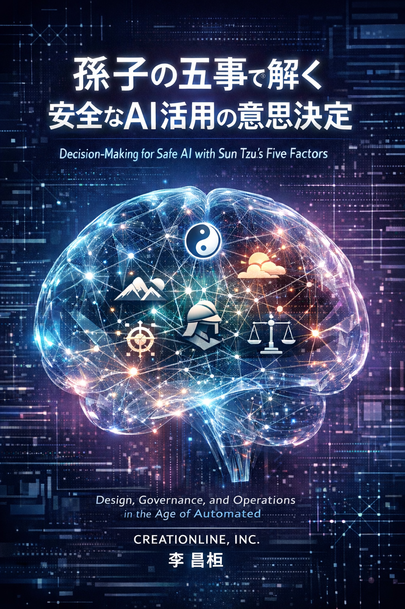

# 『孫子の五事で解く安全なAI活用の意思決定』
 

AIは、**高速かつ大量の判断を可能にする技術**です。  
しかし、**何をAIに任せるべきか**は、人間があらかじめ決めておく必要があります。

本書では、その判断基準を考える上で、古代中国の戦略書『孫子の兵法』が有効であると捉えています。  
なぜなら、**孫子は「判断を自動化する前に、人が決めるべき条件」** を明確に定義しているからです。

本書では特に、『孫子の兵法』の冒頭に登場する  
**始計篇・五事（道・天・地・将・法）** を軸に、これを **現代のAI活用に通じる戦略的指針** として読み解いていきます。

たとえば、以下のような論点を扱います：

- `AIを使ってよい条件`

- `AIに任せてよい判断の範囲`

- `AIの使用を止めるべきタイミング`

- `責任とガバナンスの設計`

本書の目的は、**AIをより賢くする方法**を解説することではありません。  
**AIが間違えにくく、安全に使われるための「判断の設計」** について考えていくことにあります。

本サイト『**孫子の五事で解く安全なAI活用の意思決定**』は、筆者がAI活用の設計論を探求する中で記録してきたメモをもとに構成しています。

これから**AI活用**を検討される方々にとって、少しでも参考になれば幸いです。

なお、掲載内容には筆者の主観による要約や再構成が含まれており、ご利用にあたっては、ご自身の判断と責任にてお願いいたします。

また、本サイトの内容は今後も適宜、更新・修正される可能性があります。あらかじめご了承ください。
 

2026年1月24日
 

**初めにことばがあった。ことばは神とともにあった。ことばは神であった。** 
（『新改訳聖書』ヨハネの福音書 1:1）

 

### 著者プロフィール
---
#### 李 昌桓（LEE CHANFUAN）

- 『<a href="https://www.creationline.com" target="_blank" rel="noopener noreferrer">クリエーションライン株式会社</a>』 に在籍
- 現代的なデータ基盤構築を専門とするソリューションアーキテクトとして活動中
- 代表的なプロジェクト:
	- 大手通信キャリアにおけるDWH基盤の設計・構築
	- Donso Factory IoT、ヨドバシカメラ、モノタロウなどにおけるデータモダナイゼーションを推進

#### 著書

- Amazon Cloudテクニカルガイド ― EC2/S3からVPCまで徹底解析、インプレスジャパン、2010
- Amazon Elastic MapReduceテクニカルガイド ― クラウド型Hadoopで実現する大規模分散処理、インプレスジャパン、2012
- Cypherクエリー言語の事例で学ぶ グラフデータベース Neo4j、インプレスR&D、2015
- Neo4jを使うグラフ型データベース入門（共著）、リックテレコム、2016
- RDB技術者のためのNoSQLガイド（共著）、秀和システム新社、2016
- [図解 Strandsエージェント徹底解説](https://github.com/awk256/strandsagents)、2026（Web公開※）  
- [図解 Amazon Bedrock徹底解説](https://github.com/awk256/amazon-bedrock)、2026（Web公開※）  
- [孫子の五事で解く安全なAI活用の意思決定](https://github.com/awk256/TheArtOfWarBySunTzu)、2026（Web公開※）
 ※本書は紙での出版予定はありません。
 

### 掲載内容について
---
**『孫子の五事で解く安全なAI活用の意思決定』** は、筆者が日頃関心を寄せている『孫子の兵法』の思想をベースに、AIとの対話を通じて得られた知見をもとに構成しています。

### 著作権・ライセンス
---
本サイトの著作権は著者に帰属します。

 - AI学習・研究目的: 出典を明記の上、自由にご利用いただけます。
 - 営利・二次利用: 無断転載や有償イベントでの利用は禁止します。
 - 改変: 自由ですが、すべて自己責任となります。

 詳細は [LICENSE](LICENSE.md) ファイルをご確認ください。
　 

### 章立てについて
---
#### 📌構成
-  [メジャー番号]-[マイナ番号]
 

### 目次 
---
#### 010.孫子の兵法（原典理解編）
- [010-000.位置づけ](010.孫子の兵法（原典理解編）/010-000.位置づけ.md)
- [010.010.孫子の兵法とは.](010.孫子の兵法（原典理解編）/010-010.孫子の兵法とは.md)
- [010-011.孫子の兵法の成立](010.孫子の兵法（原典理解編）/010-011.孫子の兵法の成立.md)
- [010-012.なぜ孫子は「西洋戦略論」と相性がいいのか](010.孫子の兵法（原典理解編）/010-012.なぜ孫子は「西洋戦略論」と相性がいいのか.md)
- [010-013.孫子と現代経営の対応関係](010.孫子の兵法（原典理解編）/010-013.孫子と現代経営の対応関係.md)
- [010.020.核心内容13篇.](010.孫子の兵法（原典理解編）/010-020.核心内容13篇.md)
- [010-021.核心内容13篇のサマリ](010.孫子の兵法（原典理解編）/010-021.核心内容13篇のサマリ.md)
- [010-030.始計篇「五事」とは](010.孫子の兵法（原典理解編）/010-030.始計篇「五事」とは.md)
- [010-040.始計篇・五事チェックリスト（現代版）](010.孫子の兵法（原典理解編）/010-040.始計篇・五事チェックリスト（現代版）.md)
- [010-050.五事が崩れた典型失敗例](010.孫子の兵法（原典理解編）/010-050.五事が崩れた典型失敗例.md)
- [010-060.五事の優先順位（孫子の思想）](010.孫子の兵法（原典理解編）/010-060.五事の優先順位（孫子の思想）.md)

#### 020.孫子の五事で設計するAI意思決定とガバナンス原則
- [020-000.位置づけ](020.孫子の五事で設計するAI意思決定とガバナンス原則/020-000.位置づけ.md)
- [020-010.基盤モデルを開発している会社は、実際に孫子を念頭に置いているのか](020.孫子の五事で設計するAI意思決定とガバナンス原則/020-010.基盤モデルを開発している会社は、実際に孫子を念頭に置いているのか.md)
- [020-011.孫子がAI時代に再評価される理由ー判断自動化との関係](020.孫子の五事で設計するAI意思決定とガバナンス原則/020-011.孫子がAI時代に再評価される理由ー判断自動化との関係.md)
- [020-012.孫子とアルゴリズム思考の完全対応表](020.孫子の五事で設計するAI意思決定とガバナンス原則/020-012.孫子とアルゴリズム思考の完全対応表.md)
- [020-013孫子は、AIサービス設計者の思考をどう変えられるか](020.孫子の五事で設計するAI意思決定とガバナンス原則/020-013孫子は、AIサービス設計者の思考をどう変えられるか.md)
- [020-014.孫子の限界ーAI時代に通用しない／補正が必要な点](020.孫子の五事で設計するAI意思決定とガバナンス原則/020-014.孫子の限界ーAI時代に通用しない／補正が必要な点.md)
- [020-020.五事＋倫理原則](020.孫子の五事で設計するAI意思決定とガバナンス原則/020-020.五事＋倫理原則.md)
- [020-021.五事を「AIレビュー・監査設計」にする](020.孫子の五事で設計するAI意思決定とガバナンス原則/020-021.五事を「AIレビュー・監査設計」にする.md)
- [020-022.AIサービス導入原則（孫子ベース）](020.孫子の五事で設計するAI意思決定とガバナンス原則/020-022.AIサービス導入原則（孫子ベース）.md)
- [020-023.孫子を「AIプロダクト設計原則」として再定義](020.孫子の五事で設計するAI意思決定とガバナンス原則/020-023.孫子を「AIプロダクト設計原則」として再定義.md)
- [020-024.五事を「AIガバナンス原則」に翻訳・結論](020.孫子の五事で設計するAI意思決定とガバナンス原則/020-024.五事を「AIガバナンス原則」に翻訳・結論.md)
- [020-030.孫子&AIの意思決定モデル](020.孫子の五事で設計するAI意思決定とガバナンス原則/020-030.孫子&AIの意思決定モデル.md)
- [020-040.孫子&AI を「1枚の統合フレーム」にする](020.孫子の五事で設計するAI意思決定とガバナンス原則/020-040.孫子&AI%20を「1枚の統合フレーム」にする.md)
- [020-050.孫子を読まない人向け・超要約](020.孫子の五事で設計するAI意思決定とガバナンス原則/020-050.孫子を読まない人向け・超要約.md)

#### 030.孫子の五事を使い切るAI実装・運用・事故対応ガイド
- [030-000.位置づけ](030.孫子の五事を使い切るAI実装・運用・事故対応ガイド/030-000.位置づけ.md)
- [030-010.【判断】五事で解くAI導入判定フロー図](030.孫子の五事を使い切るAI実装・運用・事故対応ガイド/030-010.【判断】五事で解くAI導入判定フロー図.md)
- [030-011.【判断】五事でみるプロダクト失敗事例](030.孫子の五事を使い切るAI実装・運用・事故対応ガイド/030-011.【判断】五事でみるプロダクト失敗事例.md)
- [030-013.【判断】五事でみる技術選定アンチパターン](030.孫子の五事を使い切るAI実装・運用・事故対応ガイド/030-013.【判断】五事でみる技術選定アンチパターン.md)
- [030-020.【設計】五事でみるエンジニア視点の技術判断](030.孫子の五事を使い切るAI実装・運用・事故対応ガイド/030-020.【設計】五事でみるエンジニア視点の技術判断.md)
- [030-021.【設計】五事で見るAIアーキテクチャ刷新判断](030.孫子の五事を使い切るAI実装・運用・事故対応ガイド/030-021.【設計】五事で見るAIアーキテクチャ刷新判断.md)
- [030-030.【提案】五事でみる技術提案テンプレート」](030.孫子の五事を使い切るAI実装・運用・事故対応ガイド/030-030.【提案】五事でみる技術提案テンプレート」.md)
- [030-031.【提案】五事でみる非エンジニア向けAI技術提案版（五事フレーム）](030.孫子の五事を使い切るAI実装・運用・事故対応ガイド/030-031.【提案】五事でみる非エンジニア向けAI技術提案版（五事フレーム）.md)
- [030-032.【提案】五事でみる経営層向け「AI技術提案・1ページ要約](030.孫子の五事を使い切るAI実装・運用・事故対応ガイド/030-032.【提案】五事でみる経営層向け「AI技術提案・1ページ要約.md)
- [030-040.【レビュー】五事でみる技術提案レビュー質問リスト](030.孫子の五事を使い切るAI実装・運用・事故対応ガイド/030-040.【レビュー】五事でみる技術提案レビュー質問リスト.md)
- [030-041.【レビュー】五事でみる技術提案レビュー・チェックシート](030.孫子の五事を使い切るAI実装・運用・事故対応ガイド/030-041.【レビュー】五事でみる技術提案レビュー・チェックシート.md)
- [030-042.【レビュー】AIレビュー会議テンプレ](030.孫子の五事を使い切るAI実装・運用・事故対応ガイド/030-042.【レビュー】AIレビュー会議テンプレ.md)
- [030-050.【説明】五事でみる現場向け説明トークスクリプト](030.孫子の五事を使い切るAI実装・運用・事故対応ガイド/030-050.【説明】五事でみる現場向け説明トークスクリプト.md)
- [030-060.【運用】五事でみるガバナンス最小セット（これだけは必須）](030.孫子の五事を使い切るAI実装・運用・事故対応ガイド/030-060.【運用】五事でみるガバナンス最小セット（これだけは必須）.md)
- [030-061.【運用】五事を「AIガバナンス原則」に翻訳](030.孫子の五事を使い切るAI実装・運用・事故対応ガイド/030-061.【運用】五事を「AIガバナンス原則」に翻訳.md)
- [030-070.【事故】AI停止プロトコル（事故対応・最小版）](030.孫子の五事を使い切るAI実装・運用・事故対応ガイド/030-070.【事故】AI停止プロトコル（事故対応・最小版）.md)
-