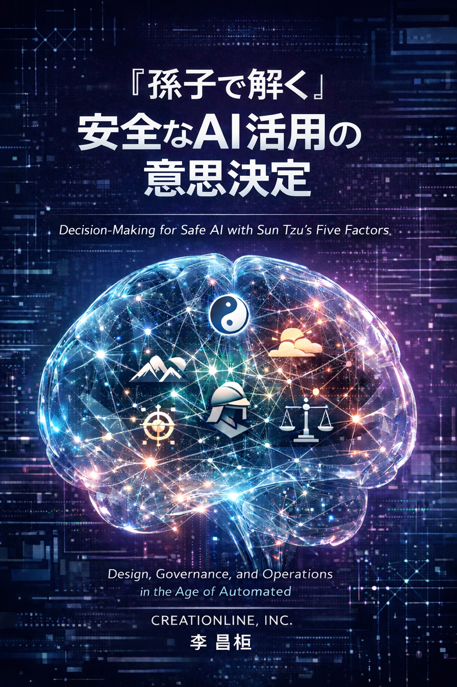

# 『孫子で解く安全なAI活用の意思決定』
 

筆者はこれまで、クラウドデータ基盤を軸にソリューションアーキテクトとして活動してきました。  
本書の執筆は、AI時代において**どのようにその役割を再定義すべきか**を真剣に考えたことが出発点です。

大きな変化として実感しているのは、従来の**意思決定を支援するためのデータ活用**から、**AIが判断プロセスに深く関与する時代**に移りつつあるということです。  
つまり、**判断の一部をAIに委ねる設計**が必要になってきている、という認識です。

そこで本書では、古代中国の戦略書『孫子の兵法』に着目しました。  
特にその冒頭「始計篇」に記された **五事（道・天・地・将・法ーWhy・When・Where・Who・How）** は、現代のAI活用に通じる**戦略的判断の枠組み**として非常に示唆に富んでいます。

本書で扱う主な論点は以下の通りです：

- `AIを使ってよい条件とは？`
- `どこまでAIに任せてよいのか？`
- `AIの利用を止めるべきタイミングとは？`
- `責任とガバナンスの設計とは？`

本書の目的は、AIをより賢く使う方法ではなく、**AIが誤らず、安全に活用されるための「判断の設計」**　について考えることにあります。

これから**AI活用**を検討される方々にとって、本書が少しでも参考になれば幸いです。

なお、掲載内容には筆者の主観による要約や再構成が含まれており、ご利用にあたっては、ご自身の判断と責任にてお願いいたします。

また、本書の内容は今後も適宜、更新・修正される可能性があります。あらかじめご了承ください。
 

2026年1月26日
 

**主は私を滅びの穴、泥沼から引き上げ、  
私の足を岩の上に立たせ、   
私の歩みを確かなものとされた。** 

（『新改訳聖書』詩編40:2）

 

### 著者プロフィール
---
#### 李 昌桓（LEE CHANFUAN）

- 『<a href="https://www.creationline.com" target="_blank" rel="noopener noreferrer">クリエーションライン株式会社</a>』 に在籍
- 現代的なデータ基盤構築を専門とするソリューションアーキテクトとして活動中
- 代表的なプロジェクト:
	- 大手通信キャリアにおけるDWH基盤の設計・構築
	- Donso Factory IoT、ヨドバシカメラ、モノタロウなどにおけるデータモダナイゼーションを推進

#### 著書

- Amazon Cloudテクニカルガイド ― EC2/S3からVPCまで徹底解析、インプレスジャパン、2010
- Amazon Elastic MapReduceテクニカルガイド ― クラウド型Hadoopで実現する大規模分散処理、インプレスジャパン、2012
- Cypherクエリー言語の事例で学ぶ グラフデータベース Neo4j、インプレスR&D、2015
- Neo4jを使うグラフ型データベース入門（共著）、リックテレコム、2016
- RDB技術者のためのNoSQLガイド（共著）、秀和システム新社、2016
- [図解 Strandsエージェント徹底解説](https://github.com/awk256/strandsagents)、2026（Web公開※）  
- [図解 Amazon Bedrock徹底解説](https://github.com/awk256/amazon-bedrock)、2026（Web公開※）  
- [孫子で解く安全なAI活用の意思決定](https://github.com/awk256/TheArtOfWarBySunTzu)、2026（Web公開※） 
 ※本書は紙での出版予定はありません。
 

### 掲載内容について
---
**『孫子の五事で解く安全なAI活用の意思決定』** は、筆者が日頃関心を寄せている『孫子の兵法』の思想をベースに、AIとの対話を通じて得られた知見をもとに構成しています。

### 著作権・ライセンス
---
本サイトの著作権は著者に帰属します。

 - AI学習・研究目的: 出典を明記の上、自由にご利用いただけます。
 - 営利・二次利用: 無断転載や有償イベントでの利用は禁止します。
 - 改変: 自由ですが、すべて自己責任となります。

 詳細は [LICENSE](LICENSE.md) ファイルをご確認ください。
　 

### 章立てについて
---
#### 📌構成
-  [メジャー番号]-[マイナ番号]
 

### 目次 
---
#### 010.孫子の兵法（原典理解編）
- [010-000.本章の位置づけ](010.孫子の兵法（原典理解編）/010-000.本章の位置づけ.md)
- [010.010.孫子の兵法とは](010.孫子の兵法（原典理解編）/010-010.孫子の兵法とは.md)
- [010-011.孫子の兵法の成立](010.孫子の兵法（原典理解編）/010-011.孫子の兵法の成立.md)
- [010-012.孫子はなぜ「西洋戦略論」と相性がいいのか](010.孫子の兵法（原典理解編）/010-012.孫子はなぜ「西洋戦略論」と相性がいいのか.md)
- [010-013.孫子と現代経営の対応関係](010.孫子の兵法（原典理解編）/010-013.孫子と現代経営の対応関係.md)
- [010.020.孫子の核心内容13篇](010.孫子の兵法（原典理解編）/010-020.孫子の核心内容13篇：戦略と設計の全解剖.md)
- [010-021.孫子の核心内容13篇の構造的グルーピング](010.孫子の兵法（原典理解編）/010-021.孫子の核心内容13篇の構造的グルーピング.md)
- [010-030.孫子の始計篇「五事」とは](010.孫子の兵法（原典理解編）/010-030.孫子の始計篇「五事」とは.md)
- [010-040.孫子の始計篇「五事」チェックリスト（現代版）](010.孫子の兵法（原典理解編）/010-040.孫子の始計篇「五事」チェックリスト（現代版）.md)
- [010-050.孫子の始計篇「五事」が崩れた典型失敗例](010.孫子の兵法（原典理解編）/010-050.孫子の始計篇「五事」が崩れた典型失敗例.md)
- [010-060.孫子の始計篇「五事」の優先順位（孫子の思想）](010.孫子の兵法（原典理解編）/010-060.孫子の始計篇「五事」の優先順位（孫子の思想）.md)
- [010-070.孫子の「五事」と5W1Hとの関係](010.孫子の兵法（原典理解編）/010-070.孫子の「五事」と5W1Hとの関係.md)
- [010-071.孫子の「五事」と4W1H：構造的マッピング](010.孫子の兵法（原典理解編）/010-071.孫子の「五事」と4W1H：構造的マッピング.md)

#### 020.孫子の五事で設計するAI意思決定とガバナンス原則
- [020-000.本章の位置づけ](020.孫子で解くAI意思決定とガバナンス原則/020-000.本章の位置づけ.md)
- [020-010.基盤モデルを開発している会社は、実際に孫子を念頭に置いているのか](020.孫子の五事で設計するAI意思決定とガバナンス原則/020-010.基盤モデルを開発している会社は、実際に孫子を念頭に置いているのか.md)
- [020-011.孫子がAI時代に再評価される理由：筆者の提言](020.孫子で解くAI意思決定とガバナンス原則/020-011.孫子がAI時代に再評価される理由：筆者の提言.md)
- [020-012.孫子とアルゴリズム思考の完全対応表](020.孫子で解くAI意思決定とガバナンス原則/020-012.孫子とアルゴリズム思考の完全対応表.md)
- [020-013.孫子による思考変化の期待](020.孫子で解くAI意思決定とガバナンス原則/020-013.孫子による思考変化の期待.md)
- [020-014.孫子でAI時代に補正が必要な点](020.孫子で解くAI意思決定とガバナンス原則/020-014.孫子でAI時代に補正が必要な点.md)
- [020-020.孫子へ現代的な倫理原則を補足](020.孫子で解くAI意思決定とガバナンス原則/020-020.孫子へ現代的な倫理原則を補足.md)
- [020-021.孫子による「AIサービスレビュー・監査設計」](020.孫子で解くAI意思決定とガバナンス原則/020-021.孫子による「AIサービスレビュー・監査設計」.md)
- [020-022.孫子による「社内AI原則」](020.孫子で解くAI意思決定とガバナンス原則/020-022.孫子による「社内AI原則」.md)
- [020-023.孫子による「AIプロダクト設計原則」](020.孫子で解くAI意思決定とガバナンス原則/020-023.孫子による「AIプロダクト設計原則」.md)
- [020-024.孫子による「AIガバナンス原則」](020.孫子で解くAI意思決定とガバナンス原則/020-024.孫子による「AIガバナンス原則」.md)
- [020-030.孫子によるAIサービスの意思決定モデル](020.孫子で解くAI意思決定とガバナンス原則/020-030.孫子によるAIサービスの意思決定モデル.md)
- [020-031.孫子による「AI意思決定フレーム」](020.孫子で解くAI意思決定とガバナンス原則/020-031.孫子による「AI意思決定フレーム」.md)
- [020-032.Human-in-the-loop（HITL）：将の介在設計](020.孫子で解くAI意思決定とガバナンス原則/020-032.Human-in-the-loop（HITL）：将の介在設計.md)
- [020-040.孫子&AI を統合した「1枚の統合フレーム」](020.孫子で解くAI意思決定とガバナンス原則/020-040.孫子&AI%20を統合した「1枚の統合フレーム」.md)
- [020-050.孫子に興味を持たない人向け・超要約～](020.孫子で解くAI意思決定とガバナンス原則/020-050.孫子に興味を持たない人向け・超要約～.md)

#### 030.孫子の五事を使い切るAI実装・運用・事故対応ガイド
- [030-000.本章の位置づけ](030.孫子の五事を使い切るAI実装ガイド/030-000.本章の位置づけ.md)
- [030-010.【判断】五事で解くAI導入判定フロー](030.孫子の五事を使い切るAI実装ガイド/030-010.【判断】五事で解くAI導入判定フロー.md)
- [030-011.【判断】五事で解くプロダクト失敗事例](030.孫子の五事を使い切るAI実装ガイド/030-011.【判断】五事で解くプロダクト失敗事例.md)
- [030-012.【判断】五事で成功事例を逆算](030.孫子の五事を使い切るAI実装ガイド/030-012.【判断】五事で成功事例を逆算.md)
- [030-013.【判断】五事で解く技術選定アンチパターン](030.孫子の五事を使い切るAI実装ガイド/030-013.【判断】五事で解く技術選定アンチパターン.md)
- [030-014.【判断】五事で解くAIプロダクトの撤退判断](030.孫子の五事を使い切るAI実装ガイド/030-014.【判断】五事で解くAIプロダクトの撤退判断.md)
- [030-015.【判断】戦略的撤退のコミュニケーション：士気を下げずに次へ繋げる技法](030.孫子の五事を使い切るAI実装ガイド/030-015.【判断】戦略的撤退のコミュニケーション：士気を下げずに次へ繋げる技法.md)
- [030-020.【設計】五事で解くエンジニア視点の技術判断](030.孫子の五事を使い切るAI実装ガイド/030-020.【設計】五事で解くエンジニア視点の技術判断.md)
- [030-021.【設計】五事で解くAIアーキテクチャ刷新判断](030.孫子の五事を使い切るAI実装ガイド/030-021.【設計】五事で解くAIアーキテクチャ刷新判断.md)
- [030-022.【設計】五事て解く継続的なAIガバナンス：評価を「点」ではなく「線」で行う仕組](030.孫子の五事を使い切るAI実装ガイド/030-022.【設計】五事て解く継続的なAIガバナンス：評価を「点」ではなく「線」で行う仕組.md)
- [030-030.【提案】五事で解く技術提案テンプレート（AI共生版）](030.孫子の五事を使い切るAI実装ガイド/030-030.【提案】五事で解く技術提案テンプレート（AI共生版）.md)
- [030-031.【提案】五事で解くAIサービス導入検討書](030.孫子の五事を使い切るAI実装ガイド/030-031.【提案】五事で解くAIサービス導入検討書.md)
- [030-032.【提案】五事で解く非エンジニア向けAI技術提案版](030.孫子の五事を使い切るAI実装ガイド/030-032.【提案】五事で解く非エンジニア向けAI技術提案版.md)
- [030-033.【提案】五事で解く経営層向け「AI技術提案・1ページ要約](030.孫子の五事を使い切るAI実装ガイド/030-033.【提案】五事で解く経営層向け「AI技術提案・1ページ要約.md)
- [030-034.【提案】五事で解く現場向け説明トークスクリプト](030.孫子の五事を使い切るAI実装ガイド/030-034.【提案】五事で解く現場向け説明トークスクリプト.md)
- [030-040.【レビュー】五事で解く技術提案レビュー質問リスト](030.孫子の五事を使い切るAI実装ガイド/030-040.【レビュー】五事で解く技術提案レビュー質問リスト.md)
- [030-041.【レビュー】五事で解く技術提案レビュー・チェックシート](030.孫子の五事を使い切るAI実装・運用・事故対応ガイド/030-041.【レビュー】五事で解く技術提案レビュー・チェックシート.md)
- [030-041.【レビュー】五事で解くAIレビュー会議テンプレ](030.孫子の五事を使い切るAI実装ガイド/030-041.【レビュー】五事で解くAIレビュー会議テンプレ.md)
- [030-050.【事故】AI事故対応プロトコル（5分以内の撤退戦）](030.孫子の五事を使い切るAI実装ガイド/030-050.【事故】AI事故対応プロトコル（5分以内の撤退戦）.md)
- [030-051.【事故】経営・法務連携版：AI事故時の対外コミュニケーションと責任定義](030.孫子の五事を使い切るAI実装ガイド/030-051.【事故】経営・法務連携版：AI事故時の対外コミュニケーションと責任定義.md)
- [030-060.【教育・啓蒙】全社員を「将」に変えるAIリテラシー研修の設計](030.孫子の五事を使い切るAI実装ガイド/030-060.【教育・啓蒙】全社員を「将」に変えるAIリテラシー研修の設計.md)
- [030-070.【最終章】AI時代を生き抜くアーキテクトの道](030.孫子の五事を使い切るAI実装ガイド/030-070.【最終章】AI時代を生き抜くアーキテクトの道.md)

